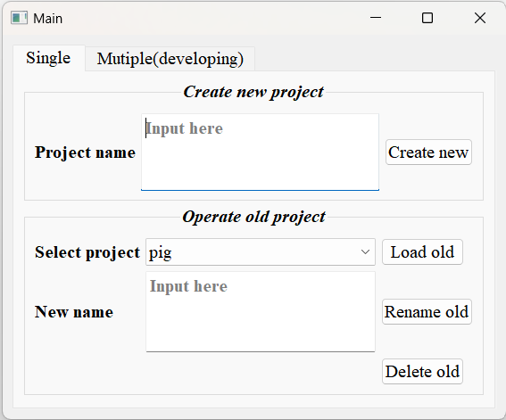
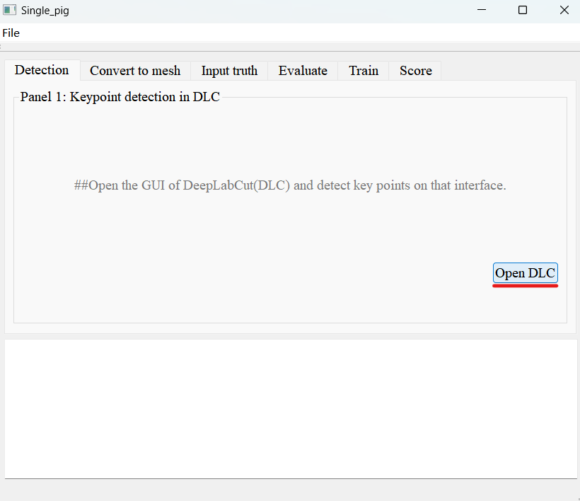
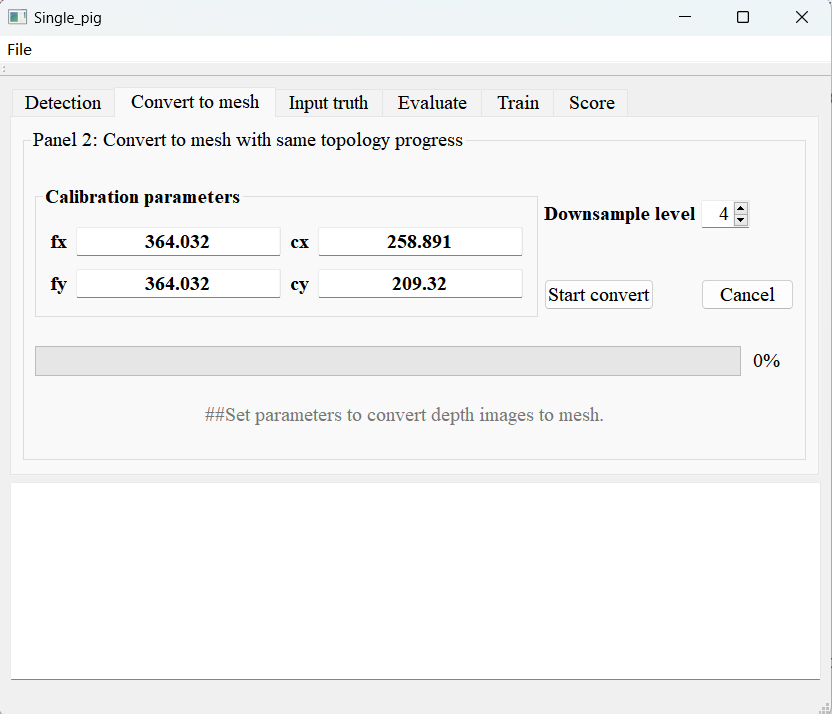
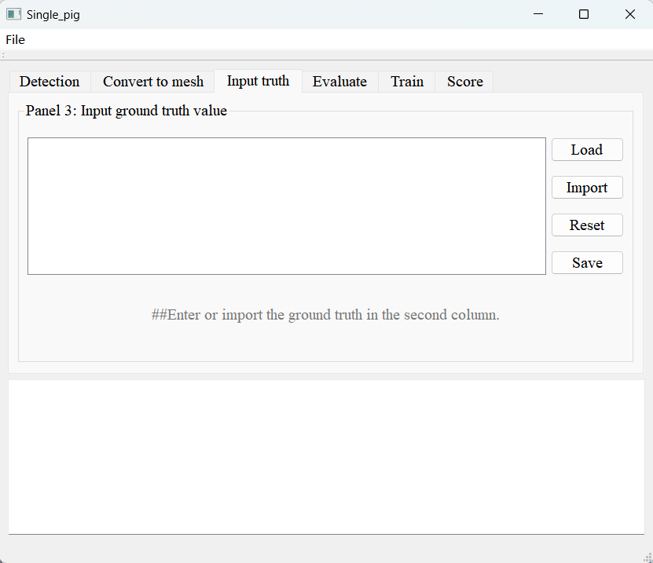
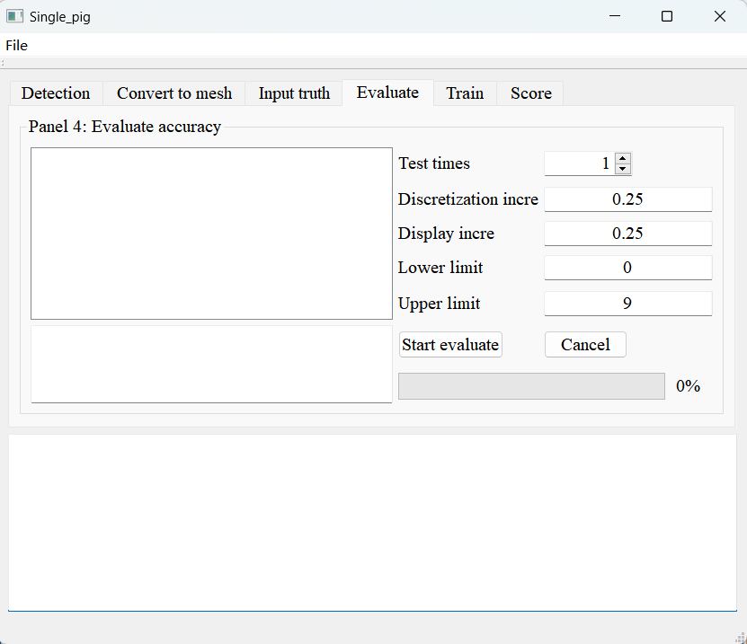
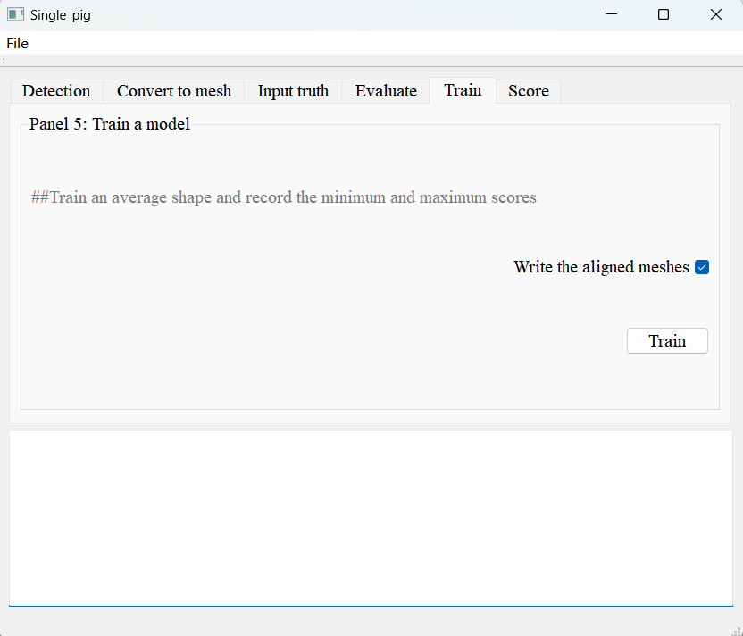

###  **The tool of C++ version is now complete, but there are still some processes that need to optimized.** 

# **LShapeAnalyser_C++** #
Created by **Jialong Zhang(张嘉龙)** from China Agricultural University.  
# Introdution #
LShapeAnalyser tool written in C++.
# Environment Requirements #
**Visual Studio 2019, PCL-1.12.1, Qt-5.14.2, OpenCV-4.6.0, CGAL-5.6, libtorch-2.0.1**
# Environment Preparation #

1. Install [anaconda](https://www.anaconda.com/data-science-platform).
2. Install [DeepLabCut 2.3.3](https://github.com/DeepLabCut/DeepLabCut/blob/main/docs/installation.md) with the methods of **CONDA**.
3. Download the [pcl-1.12.1](https://github.com/PointCloudLibrary/pcl/releases).
4. Download [Qt-5.14.2](https://download.qt.io/archive/qt/5.14/5.14.2/).
5. Download [OpenCV-4.6.0](https://sourceforge.net/projects/opencvlibrary/files/4.6.0/opencv-4.6.0-vc14_vc15.exe/download).
6. Download [CGAL-5.6](https://github.com/CGAL/cgal/releases).
7. Download [libtorch-2.0.1](https://pytorch.org/).

# Usage #
Users can directly compile and run this project in Visual studio 2019.
## Select mode ##
User can select a mode through the tab(single or multiple) in the main page.

# Single mode #
## (A)create or load a project ##
User can input the project name in the edit field in the panel "Create new project" to create a new projcet or select a old project then load in the panel "Operate old project" where can also do some other management operations.  
  
**Main page**  

## (B)Import depth image ##
After create or load a project, a new page--the project page will open. User can select 'File' in the menu bar, and then select 'Import'. A folder selection interface will pop up. Please select a folder containing the depth images you want to use (this will import all files with the extension png under this folder, so do not place other images in this folder).Then it will convert the imported depth images into grayscale images and synthesize a video with the extension avi one by one frame(used as input for DeepLabCut(DLC)).  

 **Import the depth image**   

**Converted gray image and synthetic video**  

## (C)key points detect ##
Click the 'Open DLC' button on the 'Detection' tab will open the DLC GUI. Under this interface, please follow the steps below to operate:  
1. Click on the 'create Project' button on the homepage and input the information of "Project", "Experimenter" and "Location". Then check the "Copy videos to project folder"(If unchecked, the original video will be deleted).Finally, click the "Browse videos" button and select the directory "../your project name/Preprocessed/gray";  
2. Click 'Edit config.yaml', find the 'bodyparts' parameter and expand it. Change the number and name of 'bodyparts' according to the number of key points and parts you need to mark. Then click 'save'(**Please make sure to arrange the bodyparts in the topological order of the vertices of the polygon**);  
3. Click on the 'Extract Frames' button under the 'Extract Frames' tab to extract the frames used for labeling (if you are not satisfied with the automatically extracted frames, you can also choose the manual extraction method);  
4. Click on the 'Label Frames' button on the 'Label frames' tab and select the folder ../your DLC_directory/labeled data/<the unique directory>, this will open a GUI called napari, where key points can be marked sequentially. After all frames are marked, users can press 'ctrl+s' to save the marked results;  
5. Under the 'Create training dataset' tab, select a network structure based on your computer's configuration and needs, with 'Shuffle' set to 1. Then click on the 'Training Dataset' button;  
6. Modify parameters according to your own situation in 'Train network';  
7. Import file ../your project name/Preprocessed/gray/BCS.avi in the 'Analyze videos' tab and be sure to check 'Save result(s) as csv', then click on the 'Analyze Video' button and wait it finish;  
8. Exit DLC GUI.  
For more operations and details of DLC, please refer to the official documentation provided by [DLC](https://github.com/DeepLabCut/DeepLabCut/blob/main/docs/). 

 **Open DLC page**  

## (D)Convert to mesh ##
Enter calibration parameters in the 'Convert to mesh' tab. Click the 'Start convert' button will start the conversion of the depth image to the trimmed mesh.  

 **Convert to mesh page**  

## (E)Input truth ##
Enter or import the ground truth of BCS in the 'Input BCS' tab after click 'Load BCS' button, then click 'Save BCS' button to save;  
 
 **Input BCS page**  

## (F)Evaluate accuracy ##
Modify test times in 'Evaluate' tab, and then click 'Start evaluate' button to evaluate the accuracy. Modifying the value of the 'Discretization incre' and 'Display incre' will result in a change in the discrete approximation increment of the evaluation value and the displayed result increment respectively.  

 **Evaluate page**  

## (H)Train a model ##
Click 'Train' button in the 'Train' tab to obtain an average shape and record the minimum and maximum scores as well as BCS;  

 **Train page**  
  

 **Aligned meshes**  

## (I)Score any similar image ##
Before scoring, first modify the calibration parameters corresponding to the depth image under the 'Convert to mesh' tab. Then browse the DLC project you created and select folder that contain depth images and click the 'Score' button to score. 

 **Score page**  

# Mutiple mode #
## (A)Choose mutiple project ##
Select mutiple projcet in the 'mutiple' tab. These projects must be based on the same sequence of data from different perspectives of the same batch of animals.   

 **Main page for multiple part processing**  

## (B)Train a FNN and evaluation ##
The multiple sets of data required to be selected are from the same group, and the file arrangement order and quantity are consistent. It will quickly train a FNN model according to the input and target data. Then use fnn model to predict the value.

 **FNN train page**  

  
**First completion Date: 2023/9/3. Currently, the development has been completed, but there are still detailed issues and some processes that need to be optimized.**
  