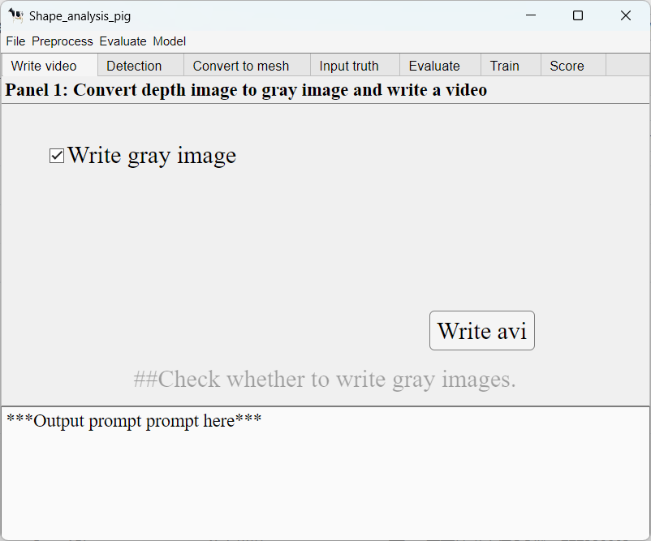
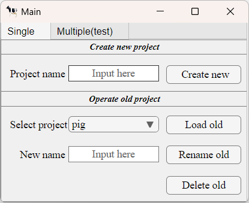
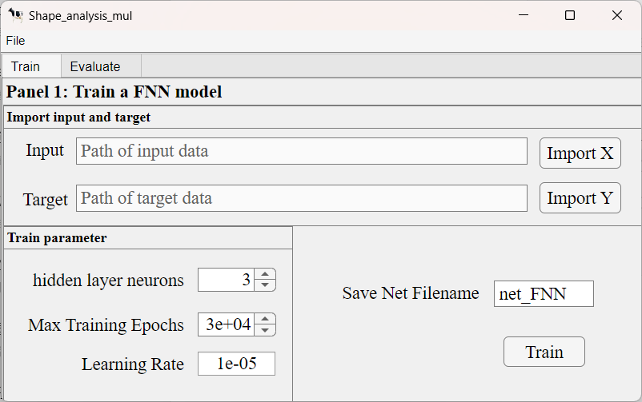

# **LShapeAnalyzer** #
Created by **Jialong Zhang** from China Agricultural University.  
# Introduction #
This project will share a tool for quantitatively analyzing the local shape of animals, mainly used for quantitatively evaluating their body condition scores(BCS).

# Tool Requirements #
*MATLAB R2023a*
# Environment Preparation #
## Step1 ##
Install [anaconda](https://www.anaconda.com/data-science-platform).
## Step2 ##
Install [DeepLabCut 2.3.3](https://github.com/DeepLabCut/DeepLabCut/blob/main/docs/installation.md) with the methods of **CONDA**.
# Usage #
Enter `Main` in the command line of MATLAB.
## Select mode ##
User can select a mode through the tab(single or multiple) in the main page. 
# Single mode #

## (A)Create or load a project
User can input the project name in the edit field in the panel "Create new project" to create a new projcet or select a old project then load in the panel "Load old project" where can also do some other management operations.  

## (B)Import depth image ##
After create or load a project, a new page--the project page will open. User can select 'File' in the menu bar, and then select 'Import'. A folder selection interface will pop up. Please select a folder containing the depth images you want to use (this will import all files with the extension png under this folder, so do not place other images in this folder).
## (C)Write a video ##
Click on 'Write avi' in the 'Write video' tab or click on 'WriteVideo' under 'Preprocess' in the menu bar will convert the imported depth images into grayscale images and synthesize a video with the extension avi one by one frame(used as input for **DeepLabCut(DLC)**).
## (D)Key point detect ##
Select 'Keypoint detect' under 'Preprocess' in the menu bar or click the 'Open DLC' button on the 'Detection' tab will open the DLC GUI. Under this interface, please follow the steps below to operate:  
1. Click on the 'create Project' button on the homepage and input the information of "Project", "Experimenter" and "Location". Then check the "Copy videos to project folder"(If unchecked, the original video will be deleted).Finally, click the "Browse videos" button and select the directory "../your project name/Preprocessed/gray";  
2. Click 'Edit config.yaml', find the 'bodyparts' parameter and expand it. Change the number and name of 'bodyparts' according to the number of key points and parts you need to mark. Then click 'save'(**Please make sure to arrange the bodyparts in the topological order of the vertices of the polygon**);  
3. Click on the 'Extract Frames' button under the 'Extract Frames' tab to extract the frames used for labeling (if you are not satisfied with the automatically extracted frames, you can also choose the manual extraction method);  
4. Click on the 'Label Frames' button on the 'Label frames' tab and select the folder ../your DLC_directory/labeled data/<the unique directory>, this will open a GUI called napari, where key points can be marked sequentially. After all frames are marked, users can press 'ctrl+s' to save the marked results;  
5. Under the 'Create training dataset' tab, select a network structure based on your computer's configuration and needs, with 'Shuffle' set to 1. Then click on the 'Training Dataset' button;  
6. Modify parameters according to your own situation in 'Train network';  
7. Import file ../your project name/Preprocessed/gray/BCS.avi in the 'Analyze videos' tab and be sure to check 'Save result(s) as csv', then click on the 'Analyze Video' button and wait it finish;  
8. Exit DLC GUI.  
For more operations and details of DLC, please refer to the official documentation provided by [DLC](https://github.com/DeepLabCut/DeepLabCut/blob/main/docs/).
## (E)Convert to mesh ##
Enter calibration parameters in the 'Convert to mesh' tab and select the triming method based on whether the circled polygons are convex or not(using non convex methods will significantly increase the processing time). Click the 'Start convert' button or the 'Convert mesh' option under 'Preprocess' in the menu bar will start the conversion of the depth image to the cropped mesh. Check the "Write original pointcloud" will write the pointcloud converted from the cropped depth images in the "../your project name/reprocessed/pointcloud/" folder. Check the "Add Non_rigid transform" will cause the mesh to perform non-rigid registration towards the point cloud;  
## (F)Input BCS ##
Enter or import the ground truth of BCS in the 'Input BCS' tab after click 'Load BCS' button, then click 'Save BCS' button to save;  
## (G)Evaluate accuracy ##
Modify test times in 'Evaluate' tab, and then click 'Start evaluate' button or 'Evaluate accuracy' under 'Evaluate' option in the menu to evaluate the accuracy. Modifying the value of the error increment will result in a change in the discrete approximation increment of the evaluation value and the displayed result increment;
## (H)Train a model ##
Click 'Start evaluate' button in the 'Train' tab or 'Train' under 'Model' option in the menu to obtain an average shape and record the minimum and maximum scores as well as BCS;
## (I)Score any similar image ##
Before scoring, first modify the calibration parameters corresponding to the depth image and the desired triming method under the 'Convert to mesh' tab. Then select individual or batch data as needed and click the 'Score' button to score. When selecting bulk data, simply select the directory containing depth images with the extension png.
# Mutiple mode #

## (A)Choose mutiple project ##
Select mutiple projcet in the 'mutiple' tab. These projects must be based on the same sequence of data from different perspectives of the same batch of animals. A network has been trained on data from three parts of beef cattle, which users can directly use for testing.  
If user need to use their own data, they need to train a new network using the ground truth values as target and predicted values obtained from the 'score' function in single project as input.
  
**Author: Jialong Zhang(张嘉龙)**  
**Unit: China Agricultural University**  
**First completion Date: July 11, 2023**  